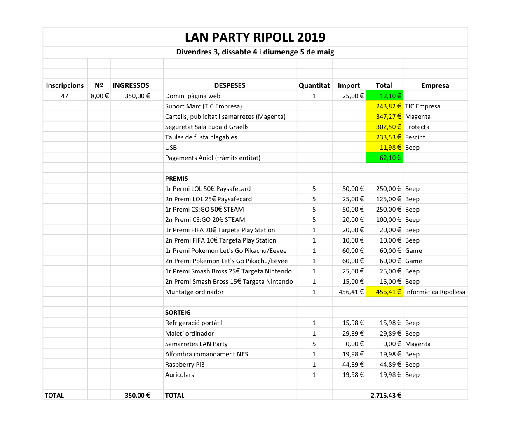

# Acta de l'Assemblea General ordinària 2020 d'ALAR

**Lloc:** Google Meet.  
**Assistents:** Anna Viñas, Gerard Izquierdo, Albert Fajula, Aniol Martí.

* S'aprova l'acta anterior per consens.
* El president presenta les activitats del 2019:
    * LAN Party Ripoll: es va celebrar els dies 3, 4 i 5 de maig.
* El tresorer presenta els comptes:

* Ningú s'oposa a l'única junta que es presenta:
    * President: Gerard Izquierdo.
    * Secretari: Aniol Martí.
    * Tresorer: Albert Fajula.
* Al torn obert es planteja fer una reunió amb el regidor aquest mateix juliol per parlar de la subvenció del 2020 i la ubicació del 2021.
* La data provisional per la LAN Party Ripoll 2021 és el 30 d'abril, 1 i 2 de maig.

El president
```


```

El secretari
```


```